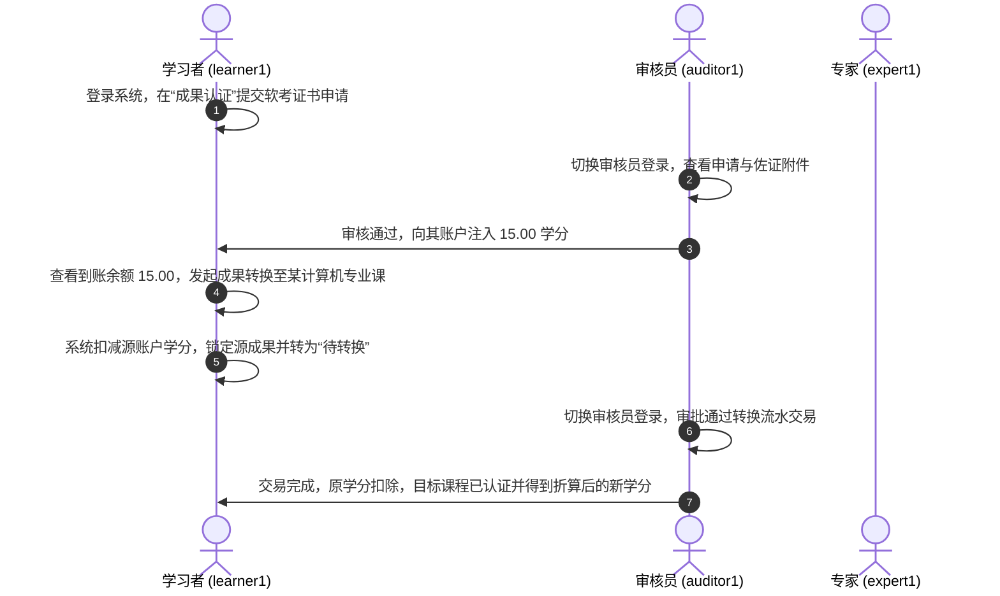

# 终身学习学分银行系统 - 使用手册

本手册旨在指导开发人员、测试人员及系统用户快速上手并全面掌握**终身学习学分银行系统**（Lifelong Learning Credit Bank）的前后端功能。

---

## 1. 系统概述与角色划分

本系统是一个面向终身学习的学习成果认定、学分累积、学分转换与档案管理的综合服务平台。系统采用 **RBAC3** 权限模型，预置了四种核心业务角色：

| 角色编码 | 角色名称 | 职能描述 | 默认账号 | 默认密码 |
| :--- | :--- | :--- | :--- | :--- |
| **admin** | 系统管理员 | 负责权限控制（RBAC3）、目录规则配置、大屏监测、日志审计与字典维护。 | `admin` | `Admin@123456` |
| **learner** | 学习者 | 提交认证申请、查询学分流水、申请成果转换、维护电子经历档案、提交反馈。 | `learner1` | `Admin@123456` |
| **auditor** | 审核员 | 审核学习成果认证申请、裁定授予学分；审核成果转换申请。 | `auditor1` | `Admin@123456` |
| **expert** | 评审专家 | 对管理员制定的学分转换规则进行专业性论证并提交意见与评语。 | `expert1` | `Admin@123456` |

---

## 2. 快速启动与本地部署

### 2.1 后端与数据库环境启动 (Docker Compose)
项目根目录提供了完整的 Docker 容器化编排环境：
1.  **打包后端 Jar 包**（需配置好 Java 17 + Maven）：
    ```bash
    mvn -DskipTests clean package
    ```
2.  **启动 Docker 服务**（包括 MySQL 8.0、Redis 7.2、Backend 服务、Nginx 网关、Jenkins）：
    ```bash
    docker compose up -d --build
    ```
3.  **连接服务地址**：
    *   Nginx 网关反向代理：`http://localhost/api`
    *   后端直接访问：`http://localhost:8080/api`
    *   Swagger API 接口文档：`http://localhost:8080/api/swagger-ui/index.html`

### 2.2 前端启动步骤 (Vue 3 + Vite)
前端代码位于桌面项目目录中：
1.  **安装 Node.js 依赖**：
    ```bash
    cd C:\Users\10792\Desktop\credit-bank-frontend
    npm install
    ```
2.  **启动本地开发服务器**：
    ```bash
    npm run dev
    ```
    *启动成功后，浏览器访问：`http://localhost:3001`*

---

## 3. 功能操作指南（按角色）

### 3.1 学习者（Learner）操作流程

#### ① 注册与登录
*   用户可在登录页通过“密码登录”或“短信验证码”登录。
*   新用户点击注册，填写用户名、真实姓名、身份证（采用前端脱敏加密传输）、手机号、验证码、工作/出生地等信息，完成账号注册。

#### ② 提交成果认证申请
*   **路径**：`认证管理 -> 提交认证`
*   **操作**：选择适合的“成果目录”（如某个特定课程或职业证书），填写证书编号、颁发机构、获得日期，上传电子证书附件（通过毛玻璃风格的文件上传组件），提交后状态转为“待审核”。

#### ③ 查看学分账户与流水
*   **路径**：`学分中心 -> 学分账户 / 学分流水`
*   **操作**：可实时查看当前可用的“学分余额”、被冻结的学分以及累计获得学分。在流水页可按时间筛选查看每笔学分获取（`earn`）、冻结（`freeze`）、扣减（`deduct`）的明细及说明。

#### ④ 申请成果转换
*   **路径**：`成果转换 -> 申请转换`
*   **操作**：选择已成功认证的源成果（如“软件设计师证书”），系统会自动匹配当前有效的转换规则（如折算为“软件工程学分”），并按比例（如 1:1.5）计算出预计可得目标学分。提交申请后，源成果对应学分会被自动冻结。

#### ⑤ 完善电子经历档案
*   **路径**：`个人档案 -> 教育经历 / 工作经历`
*   **操作**：支持对个人的历史教育经历（学校、专业、学历）和工作经历（公司、职位、起止时间）进行模块化增删改查，自动同步进个人电子档案袋中。

---

### 3.2 审核员（Auditor）操作流程

#### ① 审核认证申请
*   **路径**：`管理员端 -> 成果认证`
*   **操作**：列表展示全网所有待审核的证书认定。审核员点击“审核”，查看学习者填报的信息以及证书图片凭证。点击“通过”并输入裁定的实际学分（系统会预填基准值），或点击“驳回”并输入驳回原因。通过后，学分将自动划拨至学习者账户。

#### ② 审核转换申请
*   **路径**：`管理员端 -> 成果转换`
*   **操作**：查看学习者发起的转换申请，点击“同意”即可完成扣减源成果学分、划拨目标成果学分和记录转换交易流水；驳回则自动将冻结学分退回原账户。

---

### 3.3 特聘专家（Expert）操作流程

#### ① 转换规则评审论证
*   **路径**：`专家评审`
*   **操作**：当管理员发布了一条规则并指派专家后，专家登录即可在个人面板看到待论证任务。专家点击“评审”，填写详细论证意见，并选择投票态度（“同意”/“反对”/“保留”）。

---

### 3.4 系统管理员（Admin）操作流程

#### ① 监控大屏
*   **路径**：`管理员端 -> 首页`
*   **操作**：大屏以苹果暗黑风格设计，集成多个 ECharts 图表，动态展示全网用户总数、本周新增申请趋势、认证成果类型分布（饼图）、学分划拨Top 5排名等关键指标。

#### ② 权限与用户管理 (RBAC3)
*   **用户管理**：展示全网账号，支持一键锁定/解锁账号、重置密码以及动态分配角色。
*   **角色管理**：支持自定义新角色，并拥有一套交互式“权限授权树”，可以精确给角色勾选前端路由菜单与页面内功能按钮。
*   **权限树维护**：管理前端页面路径、组件绑定及按钮级权限编码。

#### ③ 规则库制定与指派
*   **路径**：`管理员端 -> 转换规则管理`
*   **操作**：制定例如“A证书折算为B课程学分”的比例关系，并指派多名专家进行同行论证。当专家论证通过率达标后，可一键将其设为“生效”状态。

#### ④ 字典与基础支撑
*   **数据字典**：提供双层交互控制，左侧选择字典类型（如成果状态、转换状态），右侧维护具体项的键值对，修改后热刷新前端。
*   **站内公告**：管理员可通过内置编辑器撰写富文本系统公告，推送给所有学习者。
*   **日志审计**：记录全系统所有 HTTP 操作日志，支持根据操作模块、IP地址、成功/失败状态对日志进行精确追踪审计。

---

## 4. 全链路业务测试场景示例 (E2E Walkthrough)

### 场景：从注册新用户到获得学分并完成学分折算



1.  **准备规则**：确保管理员已配置好 `软件设计师证书` 转换为 `软件工程课程` 的规则，且规则状态为“生效”。
2.  **学习者认证**：登录 `learner1`（密码 `Admin@123456`），提交 `软件设计师证书` 的认证，上传佐证图片。
3.  **审核通过**：登录 `auditor1` 审批该申请，实际授予 `10` 学分。
4.  **发起转换**：登录 `learner1`，在 `成果转换` 页面选择刚才成功的证书，转换至 `软件工程` 课程，此时余额中的 `10` 学分被冻结。
5.  **审核转换**：登录 `auditor1` 审批通过转换。`learner1` 的源学分正式扣除，同时生成了 `软件工程` 课程成果资产。
