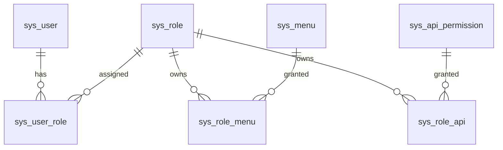

# 数据库结构

## 1. 设计依据

本文根据项目根目录《功能需求.docx》整理数据库结构。系统核心业务包括用户登录注册、RBAC3 权限、学习成果目录、学习成果认证、学分账户、成果转换、专家评审、站内信、系统日志、数据字典、学习成果导览、转换规则库浏览、学习者档案、系统公告、意见反馈和统计分析。

数据库建议使用 MySQL 8.x，存储引擎使用 InnoDB，字符集使用 `utf8mb4`。Redis 仅作为验证码、字典、权限菜单等热点数据缓存，不作为主数据存储。

## 2. 通用约定

### 2.1 通用字段

除日志、流水、关系表等特殊表外，业务表默认包含以下字段：

| 字段 | 类型 | 约束 | 说明 |
| --- | --- | --- | --- |
| id | bigint unsigned | PK | 主键 |
| created_by | bigint unsigned | nullable | 创建人用户 ID |
| created_at | datetime | not null | 创建时间 |
| updated_by | bigint unsigned | nullable | 更新人用户 ID |
| updated_at | datetime | nullable | 更新时间 |
| deleted | tinyint | not null default 0 | 逻辑删除标记，0 未删除，1 已删除 |
| remark | varchar(500) | nullable | 备注 |

### 2.2 状态与枚举

状态值统一维护在数据字典中，业务表保存稳定编码。建议初始化以下字典：

| 字典编码 | 说明 | 建议字典项 |
| --- | --- | --- |
| user_status | 用户状态 | enabled, disabled, frozen |
| role_status | 角色状态 | enabled, disabled |
| menu_type | 菜单类型 | catalog, menu, button |
| outcome_type | 成果类型 | course_cert, diploma_cert, degree_cert, vocational_qualification, skill_level, training_cert |
| catalog_audit_status | 成果目录审核状态 | draft, pending, approved, rejected |
| catalog_status | 成果目录状态 | enabled, disabled |
| application_status | 申请状态 | pending, approved, rejected, withdrawn |
| credit_change_type | 学分变动类型 | earn, deduct, freeze, unfreeze |
| conversion_rule_status | 转换规则状态 | draft, reviewing, effective, abolished |
| expert_status | 专家状态 | available, leave, removed |
| expert_review_opinion | 专家意见 | support, oppose, reserve |
| message_read_status | 站内信状态 | unread, read |
| announcement_status | 公告状态 | enabled, disabled |
| feedback_status | 反馈状态 | pending, processed |

### 2.3 敏感信息

身份证号、手机号等敏感字段建议采用“密文 + 哈希”方式保存：

| 字段后缀 | 说明 |
| --- | --- |
| `_cipher` | 加密后的原文，用于必要时解密展示 |
| `_hash` | 不可逆哈希，用于唯一校验、登录匹配、条件查询 |

前端展示由接口层统一脱敏，数据库不保存已脱敏字符串作为主数据。

## 3. 表清单

| 模块 | 表名 | 说明 |
| --- | --- | --- |
| 用户权限 | sys_user | 用户主表 |
| 用户权限 | sys_sms_code | 手机验证码记录 |
| 用户权限 | sys_role | 角色表 |
| 用户权限 | sys_user_role | 用户角色关系 |
| 用户权限 | sys_role_hierarchy | 角色继承关系 |
| 用户权限 | sys_role_constraint | RBAC3 角色约束 |
| 用户权限 | sys_menu | 前端菜单与路由权限 |
| 用户权限 | sys_api_permission | API 接口权限 |
| 用户权限 | sys_role_menu | 角色菜单权限关系 |
| 用户权限 | sys_role_api | 角色 API 权限关系 |
| 成果目录 | learn_outcome_catalog | 学习成果目录 |
| 认证申请 | cert_application | 学习成果认证申请 |
| 认证申请 | learner_outcome | 学习者已认证成果 |
| 学分账户 | credit_account | 学分账户 |
| 学分账户 | credit_flow | 学分明细与流水 |
| 转换规则 | conversion_rule | 成果转换规则 |
| 专家评审 | expert_profile | 专家库 |
| 专家评审 | conversion_rule_review | 转换规则专家评审 |
| 转换申请 | conversion_application | 成果转换申请 |
| 转换申请 | conversion_transaction | 转换交易流水 |
| 审核记录 | biz_audit_record | 通用审核轨迹 |
| 文件附件 | sys_file | 对象存储文件元数据 |
| 消息公告 | sys_message | 站内消息 |
| 消息公告 | sys_message_receiver | 站内消息接收状态 |
| 消息公告 | sys_announcement | 系统公告 |
| 学习者档案 | learner_education_experience | 教育经历 |
| 学习者档案 | learner_work_experience | 工作经历 |
| 反馈 | sys_feedback | 意见反馈 |
| 系统支撑 | sys_operation_log | 系统操作日志 |
| 系统支撑 | sys_dict | 数据字典 |
| 系统支撑 | sys_dict_item | 数据字典项 |
| 统计分析 | stat_daily_summary | 每日统计快照，可选 |

## 4. 表结构明细

### 4.1 sys_user 用户主表

保存学习者、审核员、专家、管理员的统一登录账号。登录密码使用 BCrypt 加盐哈希后写入 `password_hash`。

| 字段 | 类型 | 约束 | 说明 |
| --- | --- | --- | --- |
| username | varchar(64) | uk, not null | 登录账号 |
| password_hash | varchar(100) | nullable | BCrypt 密码哈希，验证码登录用户可为空 |
| real_name | varchar(50) | nullable | 姓名 |
| id_card_cipher | varchar(255) | nullable | 身份证号密文 |
| id_card_hash | char(64) | idx | 身份证号哈希 |
| phone_cipher | varchar(255) | nullable | 手机号密文 |
| phone_hash | char(64) | uk | 手机号哈希 |
| email | varchar(100) | nullable | 邮箱 |
| avatar_file_id | bigint unsigned | FK sys_file.id | 头像文件 |
| birth_place | varchar(255) | nullable | 出生地址 |
| current_address | varchar(255) | nullable | 现居住地 |
| status | varchar(32) | idx, not null | 用户状态 |
| password_updated_at | datetime | nullable | 密码最后修改时间 |
| last_login_at | datetime | nullable | 最近登录时间 |
| last_login_ip | varchar(45) | nullable | 最近登录 IP |

建议索引：

| 索引 | 字段 | 说明 |
| --- | --- | --- |
| uk_sys_user_username | username | 账号唯一 |
| uk_sys_user_phone_hash | phone_hash | 手机号唯一 |
| idx_sys_user_status | status | 用户状态筛选 |
| idx_sys_user_real_name | real_name | 用户列表姓名查询 |

### 4.2 sys_sms_code 手机验证码记录

用于手机号验证码登录、注册、密码重置等场景。验证码只保存哈希，不保存明文。

| 字段 | 类型 | 约束 | 说明 |
| --- | --- | --- | --- |
| phone_hash | char(64) | idx, not null | 手机号哈希 |
| scene | varchar(32) | idx, not null | 场景，login/register/reset_password |
| code_hash | varchar(100) | not null | 验证码哈希 |
| expire_at | datetime | idx, not null | 过期时间 |
| used_at | datetime | nullable | 使用时间 |
| verify_fail_count | int | not null default 0 | 校验失败次数 |
| request_ip | varchar(45) | nullable | 请求 IP |
| created_at | datetime | not null | 创建时间 |

### 4.3 sys_role 角色表

内置学习者、审核员、专家、管理员四类角色，同时支持管理员创建、编辑、删除角色。

| 字段 | 类型 | 约束 | 说明 |
| --- | --- | --- | --- |
| role_code | varchar(64) | uk, not null | 角色编码 |
| role_name | varchar(64) | not null | 角色名称 |
| description | varchar(255) | nullable | 角色描述 |
| status | varchar(32) | idx, not null | 角色状态 |
| sort_no | int | not null default 0 | 排序号 |

### 4.4 sys_user_role 用户角色关系

支持一个用户分配一个或多个角色。

| 字段 | 类型 | 约束 | 说明 |
| --- | --- | --- | --- |
| user_id | bigint unsigned | FK sys_user.id | 用户 ID |
| role_id | bigint unsigned | FK sys_role.id | 角色 ID |
| assigned_by | bigint unsigned | nullable | 分配人 |
| assigned_at | datetime | not null | 分配时间 |

唯一索引：`uk_sys_user_role_user_role(user_id, role_id)`。

### 4.5 sys_role_hierarchy 角色继承关系

RBAC3 扩展表，用于表达角色继承关系。

| 字段 | 类型 | 约束 | 说明 |
| --- | --- | --- | --- |
| parent_role_id | bigint unsigned | FK sys_role.id | 父角色 |
| child_role_id | bigint unsigned | FK sys_role.id | 子角色 |
| created_at | datetime | not null | 创建时间 |

唯一索引：`uk_sys_role_hierarchy(parent_role_id, child_role_id)`。

### 4.6 sys_role_constraint 角色约束

RBAC3 扩展表，用于静态职责分离、动态职责分离等角色约束。

| 字段 | 类型 | 约束 | 说明 |
| --- | --- | --- | --- |
| constraint_code | varchar(64) | uk, not null | 约束编码 |
| constraint_name | varchar(100) | not null | 约束名称 |
| constraint_type | varchar(32) | not null | 约束类型，如 static_separation/dynamic_separation |
| role_ids_json | json | not null | 参与约束的角色 ID 列表 |
| max_active_count | int | nullable | 最多可同时拥有或激活的角色数 |
| status | varchar(32) | not null | 状态 |

### 4.7 sys_menu 前端菜单与路由权限

用于动态生成前端路由菜单，实现菜单级权限控制。

| 字段 | 类型 | 约束 | 说明 |
| --- | --- | --- | --- |
| parent_id | bigint unsigned | idx | 父菜单 ID |
| menu_code | varchar(64) | uk, not null | 菜单权限编码 |
| menu_name | varchar(100) | not null | 菜单名称 |
| menu_type | varchar(32) | not null | catalog/menu/button |
| route_path | varchar(255) | nullable | 前端路由路径 |
| component | varchar(255) | nullable | 前端组件路径 |
| route_name | varchar(100) | nullable | 路由名称 |
| icon | varchar(100) | nullable | 图标 |
| permission_code | varchar(100) | nullable | 按钮级权限标识 |
| visible | tinyint | not null default 1 | 是否显示 |
| status | varchar(32) | idx, not null | 状态 |
| sort_no | int | not null default 0 | 排序号 |

### 4.8 sys_api_permission API 接口权限

用于 Spring Security 拦截器进行 API 级权限校验。

| 字段 | 类型 | 约束 | 说明 |
| --- | --- | --- | --- |
| api_code | varchar(100) | uk, not null | API 权限编码 |
| api_name | varchar(100) | not null | API 名称 |
| module | varchar(64) | idx | 所属模块 |
| http_method | varchar(16) | not null | GET/POST/PUT/DELETE |
| path_pattern | varchar(255) | idx, not null | 接口路径匹配规则 |
| status | varchar(32) | idx, not null | 状态 |

### 4.9 sys_role_menu 角色菜单权限关系

| 字段 | 类型 | 约束 | 说明 |
| --- | --- | --- | --- |
| role_id | bigint unsigned | FK sys_role.id | 角色 ID |
| menu_id | bigint unsigned | FK sys_menu.id | 菜单 ID |
| created_at | datetime | not null | 创建时间 |

唯一索引：`uk_sys_role_menu(role_id, menu_id)`。

### 4.10 sys_role_api 角色 API 权限关系

| 字段 | 类型 | 约束 | 说明 |
| --- | --- | --- | --- |
| role_id | bigint unsigned | FK sys_role.id | 角色 ID |
| api_id | bigint unsigned | FK sys_api_permission.id | API 权限 ID |
| created_at | datetime | not null | 创建时间 |

唯一索引：`uk_sys_role_api(role_id, api_id)`。

### 4.11 learn_outcome_catalog 学习成果目录

维护平台认可的学习成果目录，供成果导览、认证申请、转换规则使用。

| 字段 | 类型 | 约束 | 说明 |
| --- | --- | --- | --- |
| outcome_code | varchar(64) | uk, not null | 成果编码 |
| outcome_name | varchar(200) | idx, not null | 成果名称 |
| outcome_type | varchar(64) | idx, not null | 成果类型 |
| base_credit | decimal(10,2) | not null default 0 | 基准学分值 |
| audit_status | varchar(32) | idx, not null | 审核状态 |
| status | varchar(32) | idx, not null | 启用/停用状态 |
| intro | text | nullable | 成果简介 |
| certification_requirements | text | nullable | 认证要求 |
| applicable_scope | text | nullable | 适用范围 |

建议索引：`idx_outcome_catalog_type_status(outcome_type, status)`。

### 4.12 cert_application 学习成果认证申请

学习者提交成果认证申请后进入待审核状态，审核通过后生成已认证成果并划拨学分。

| 字段 | 类型 | 约束 | 说明 |
| --- | --- | --- | --- |
| application_no | varchar(64) | uk, not null | 申请编号 |
| applicant_id | bigint unsigned | FK sys_user.id, idx | 申请人 |
| catalog_id | bigint unsigned | FK learn_outcome_catalog.id | 对应成果目录 |
| certify_type | varchar(64) | idx, not null | 认证类型 |
| outcome_name | varchar(200) | not null | 成果名称 |
| certificate_no | varchar(100) | idx | 证书编号 |
| issuing_authority | varchar(200) | nullable | 发证机关 |
| obtained_at | date | nullable | 获得时间 |
| requested_credit | decimal(10,2) | nullable | 申请认定学分 |
| recognized_credit | decimal(10,2) | nullable | 审核认定学分 |
| status | varchar(32) | idx, not null | pending/approved/rejected/withdrawn |
| submitted_at | datetime | nullable | 提交时间 |
| withdrawn_at | datetime | nullable | 撤回时间 |
| audit_user_id | bigint unsigned | FK sys_user.id | 审核员 |
| audited_at | datetime | nullable | 审核时间 |
| reject_reason | varchar(500) | nullable | 驳回理由 |

佐证材料通过 `sys_file` 保存，`sys_file.biz_type = 'cert_application'`，`sys_file.biz_id = cert_application.id`。

### 4.13 learner_outcome 学习者已认证成果

记录学习者可用于转换的成果资产。认证审核通过或转换审核通过后写入。

| 字段 | 类型 | 约束 | 说明 |
| --- | --- | --- | --- |
| user_id | bigint unsigned | FK sys_user.id, idx | 学习者 |
| catalog_id | bigint unsigned | FK learn_outcome_catalog.id, idx | 成果目录 |
| source_type | varchar(32) | idx, not null | 来源，certification/conversion |
| source_application_id | bigint unsigned | idx, not null | 来源申请 ID |
| outcome_name | varchar(200) | not null | 成果名称快照 |
| certificate_no | varchar(100) | nullable | 证书编号 |
| issuing_authority | varchar(200) | nullable | 发证机关 |
| obtained_at | date | nullable | 获得时间 |
| total_credit | decimal(10,2) | not null default 0 | 总学分 |
| available_credit | decimal(10,2) | not null default 0 | 可用学分 |
| frozen_credit | decimal(10,2) | not null default 0 | 冻结学分 |
| status | varchar(32) | idx, not null | valid/invalid |
| certified_at | datetime | not null | 认证生效时间 |

### 4.14 credit_account 学分账户

每个学习者一个学分账户。

| 字段 | 类型 | 约束 | 说明 |
| --- | --- | --- | --- |
| user_id | bigint unsigned | uk, FK sys_user.id | 学习者 |
| balance | decimal(10,2) | not null default 0 | 可用学分余额 |
| frozen_credit | decimal(10,2) | not null default 0 | 冻结学分 |
| total_earned | decimal(10,2) | not null default 0 | 累计获得学分 |
| total_deducted | decimal(10,2) | not null default 0 | 累计扣减学分 |
| version | int | not null default 0 | 乐观锁版本 |

### 4.15 credit_flow 学分明细与流水

记录每笔学分获取、扣减、冻结、解冻，支撑学习者学分明细筛选。

| 字段 | 类型 | 约束 | 说明 |
| --- | --- | --- | --- |
| flow_no | varchar(64) | uk, not null | 流水号 |
| account_id | bigint unsigned | FK credit_account.id | 学分账户 |
| user_id | bigint unsigned | FK sys_user.id, idx | 学习者 |
| learner_outcome_id | bigint unsigned | FK learner_outcome.id | 关联成果 |
| biz_type | varchar(64) | idx, not null | certification/conversion |
| biz_id | bigint unsigned | idx, not null | 业务单据 ID |
| change_type | varchar(32) | idx, not null | earn/deduct/freeze/unfreeze |
| credit_amount | decimal(10,2) | not null | 变动学分 |
| balance_before | decimal(10,2) | not null | 变动前可用余额 |
| balance_after | decimal(10,2) | not null | 变动后可用余额 |
| frozen_before | decimal(10,2) | not null | 变动前冻结学分 |
| frozen_after | decimal(10,2) | not null | 变动后冻结学分 |
| description | varchar(500) | nullable | 流水说明 |
| created_at | datetime | idx, not null | 发生时间 |

建议索引：`idx_credit_flow_user_time(user_id, created_at)`、`idx_credit_flow_user_type(user_id, change_type)`。

### 4.16 conversion_rule 成果转换规则

管理员创建转换规则，专家评审通过后方可生效。

| 字段 | 类型 | 约束 | 说明 |
| --- | --- | --- | --- |
| rule_code | varchar(64) | uk, not null | 规则编码 |
| rule_name | varchar(200) | idx, not null | 规则名称 |
| source_catalog_id | bigint unsigned | FK learn_outcome_catalog.id, idx | 源成果目录 |
| target_catalog_id | bigint unsigned | FK learn_outcome_catalog.id, idx | 目标成果目录 |
| conversion_ratio | decimal(10,4) | not null | 折算比例 |
| status | varchar(32) | idx, not null | draft/reviewing/effective/abolished |
| enabled | tinyint | not null default 1 | 是否启用 |
| description | text | nullable | 规则说明 |
| applicable_condition | text | nullable | 适用条件 |
| submitted_at | datetime | nullable | 提交评审时间 |
| effective_at | datetime | nullable | 生效时间 |
| abolished_at | datetime | nullable | 废止时间 |

建议索引：`idx_conversion_rule_query(status, source_catalog_id, target_catalog_id)`。

### 4.17 expert_profile 专家库

专家可绑定系统用户账号，用于登录后处理评审任务。

| 字段 | 类型 | 约束 | 说明 |
| --- | --- | --- | --- |
| user_id | bigint unsigned | uk, FK sys_user.id | 专家登录用户，可为空后补绑定 |
| expert_name | varchar(50) | not null | 专家姓名 |
| title | varchar(100) | nullable | 职称 |
| professional_direction | varchar(200) | idx | 专业方向 |
| contact_phone_cipher | varchar(255) | nullable | 联系电话密文 |
| contact_phone_hash | char(64) | idx | 联系电话哈希 |
| email | varchar(100) | nullable | 邮箱 |
| status | varchar(32) | idx, not null | available/leave/removed |

### 4.18 conversion_rule_review 转换规则专家评审

记录管理员为转换规则指派专家后的评审意见。

| 字段 | 类型 | 约束 | 说明 |
| --- | --- | --- | --- |
| rule_id | bigint unsigned | FK conversion_rule.id, idx | 转换规则 |
| expert_id | bigint unsigned | FK expert_profile.id, idx | 专家 |
| assigned_by | bigint unsigned | FK sys_user.id | 指派管理员 |
| assigned_at | datetime | not null | 指派时间 |
| status | varchar(32) | idx, not null | pending/reviewed/canceled |
| opinion | varchar(32) | nullable | support/oppose/reserve |
| review_comment | text | nullable | 评审意见 |
| reviewed_at | datetime | nullable | 评审时间 |

唯一索引：`uk_rule_review_expert(rule_id, expert_id)`。

### 4.19 conversion_application 成果转换申请

学习者选择已认证源成果后提交转换申请，提交时冻结源成果对应学分。

| 字段 | 类型 | 约束 | 说明 |
| --- | --- | --- | --- |
| application_no | varchar(64) | uk, not null | 申请编号 |
| applicant_id | bigint unsigned | FK sys_user.id, idx | 申请人 |
| rule_id | bigint unsigned | FK conversion_rule.id, idx | 转换规则 |
| source_outcome_id | bigint unsigned | FK learner_outcome.id | 源已认证成果 |
| source_catalog_id | bigint unsigned | FK learn_outcome_catalog.id | 源成果目录快照 |
| target_catalog_id | bigint unsigned | FK learn_outcome_catalog.id | 目标成果目录快照 |
| source_credit | decimal(10,2) | not null | 冻结或扣减的源学分 |
| conversion_ratio | decimal(10,4) | not null | 折算比例快照 |
| target_credit | decimal(10,2) | not null | 预计或实际目标学分 |
| status | varchar(32) | idx, not null | pending/approved/rejected/withdrawn |
| freeze_flow_id | bigint unsigned | FK credit_flow.id | 冻结流水 |
| target_outcome_id | bigint unsigned | FK learner_outcome.id | 审核通过生成的目标成果 |
| submitted_at | datetime | nullable | 提交时间 |
| audit_user_id | bigint unsigned | FK sys_user.id | 审核员 |
| audited_at | datetime | nullable | 审核时间 |
| reject_reason | varchar(500) | nullable | 驳回理由 |

建议索引：`idx_conversion_app_query(status, submitted_at)`、`idx_conversion_app_user(applicant_id, submitted_at)`。

### 4.20 conversion_transaction 转换交易流水

转换审核通过后记录源学分扣减、目标学分增加的交易结果。

| 字段 | 类型 | 约束 | 说明 |
| --- | --- | --- | --- |
| transaction_no | varchar(64) | uk, not null | 交易流水号 |
| application_id | bigint unsigned | uk, FK conversion_application.id | 转换申请 |
| user_id | bigint unsigned | FK sys_user.id, idx | 学习者 |
| source_outcome_id | bigint unsigned | FK learner_outcome.id | 源成果 |
| target_outcome_id | bigint unsigned | FK learner_outcome.id | 目标成果 |
| deduct_flow_id | bigint unsigned | FK credit_flow.id | 扣减流水 |
| earn_flow_id | bigint unsigned | FK credit_flow.id | 增加流水 |
| source_credit | decimal(10,2) | not null | 扣减源学分 |
| target_credit | decimal(10,2) | not null | 增加目标学分 |
| converted_at | datetime | not null | 转换完成时间 |

### 4.21 biz_audit_record 通用审核轨迹

用于认证申请、转换申请、转换规则评审等业务的进度展示和历史追踪。

| 字段 | 类型 | 约束 | 说明 |
| --- | --- | --- | --- |
| biz_type | varchar(64) | idx, not null | 业务类型 |
| biz_id | bigint unsigned | idx, not null | 业务 ID |
| operator_id | bigint unsigned | FK sys_user.id | 操作人 |
| action | varchar(32) | idx, not null | submit/approve/reject/withdraw/assign/review |
| from_status | varchar(32) | nullable | 操作前状态 |
| to_status | varchar(32) | nullable | 操作后状态 |
| opinion | text | nullable | 意见或理由 |
| operated_at | datetime | idx, not null | 操作时间 |

建议索引：`idx_audit_record_biz(biz_type, biz_id, operated_at)`。

### 4.22 sys_file 对象存储文件元数据

证书材料、高清扫描件、头像、反馈截图等文件统一登记在此表，文件实体保存在对象存储服务。

| 字段 | 类型 | 约束 | 说明 |
| --- | --- | --- | --- |
| biz_type | varchar(64) | idx | 业务类型，如 cert_application/feedback/avatar |
| biz_id | bigint unsigned | idx | 业务 ID |
| uploader_id | bigint unsigned | FK sys_user.id | 上传人 |
| original_name | varchar(255) | not null | 原文件名 |
| file_name | varchar(255) | not null | 存储文件名 |
| bucket_name | varchar(100) | not null | 对象存储桶 |
| object_key | varchar(500) | uk, not null | 对象存储 key |
| file_url | varchar(1000) | nullable | 访问 URL |
| content_type | varchar(100) | nullable | MIME 类型 |
| file_ext | varchar(32) | nullable | 扩展名 |
| file_size | bigint unsigned | not null default 0 | 文件大小 |
| file_md5 | char(32) | nullable | MD5 |
| status | varchar(32) | not null | 状态 |

### 4.23 sys_message 站内消息

系统自动推送认证审核结果、转换审核结果、专家评审任务、系统公告等消息。

| 字段 | 类型 | 约束 | 说明 |
| --- | --- | --- | --- |
| message_title | varchar(200) | not null | 标题 |
| message_content | text | not null | 内容 |
| message_type | varchar(64) | idx, not null | 消息类型 |
| trigger_scene | varchar(64) | idx | 触发场景 |
| sender_id | bigint unsigned | FK sys_user.id | 发送人，系统消息可为空 |
| biz_type | varchar(64) | nullable | 关联业务类型 |
| biz_id | bigint unsigned | nullable | 关联业务 ID |
| sent_at | datetime | idx, not null | 发送时间 |

### 4.24 sys_message_receiver 站内消息接收状态

| 字段 | 类型 | 约束 | 说明 |
| --- | --- | --- | --- |
| message_id | bigint unsigned | FK sys_message.id | 消息 ID |
| receiver_id | bigint unsigned | FK sys_user.id, idx | 接收人 |
| read_status | varchar(32) | idx, not null | unread/read |
| read_at | datetime | nullable | 阅读时间 |
| receiver_deleted | tinyint | not null default 0 | 接收人侧删除标记 |

唯一索引：`uk_message_receiver(message_id, receiver_id)`。

### 4.25 sys_announcement 系统公告

公告内容支持富文本。

| 字段 | 类型 | 约束 | 说明 |
| --- | --- | --- | --- |
| title | varchar(200) | idx, not null | 公告标题 |
| content | longtext | not null | 公告内容 |
| status | varchar(32) | idx, not null | enabled/disabled |
| publish_at | datetime | idx | 发布时间 |
| publisher_id | bigint unsigned | FK sys_user.id | 发布人 |
| sort_no | int | not null default 0 | 排序号 |
| view_count | bigint unsigned | not null default 0 | 浏览次数 |

### 4.26 learner_education_experience 教育经历

| 字段 | 类型 | 约束 | 说明 |
| --- | --- | --- | --- |
| user_id | bigint unsigned | FK sys_user.id, idx | 学习者 |
| school_name | varchar(200) | not null | 学校名称 |
| major | varchar(200) | nullable | 专业 |
| education_level | varchar(64) | nullable | 学历 |
| enrollment_date | date | nullable | 入学时间 |
| graduation_date | date | nullable | 毕业时间 |
| description | varchar(500) | nullable | 说明 |

### 4.27 learner_work_experience 工作经历

| 字段 | 类型 | 约束 | 说明 |
| --- | --- | --- | --- |
| user_id | bigint unsigned | FK sys_user.id, idx | 学习者 |
| company_name | varchar(200) | not null | 公司名称 |
| position | varchar(200) | nullable | 职位 |
| entry_date | date | nullable | 入职时间 |
| leave_date | date | nullable | 离职时间 |
| description | varchar(500) | nullable | 工作描述 |

### 4.28 sys_feedback 意见反馈

反馈截图附件通过 `sys_file` 保存，`sys_file.biz_type = 'feedback'`。

| 字段 | 类型 | 约束 | 说明 |
| --- | --- | --- | --- |
| feedback_no | varchar(64) | uk, not null | 反馈编号 |
| user_id | bigint unsigned | FK sys_user.id, idx | 反馈人 |
| title | varchar(200) | not null | 反馈标题 |
| content | text | not null | 反馈内容 |
| contact | varchar(200) | nullable | 联系方式 |
| status | varchar(32) | idx, not null | pending/processed |
| reply_content | text | nullable | 回复内容 |
| reply_admin_id | bigint unsigned | FK sys_user.id | 回复管理员 |
| replied_at | datetime | nullable | 回复时间 |

### 4.29 sys_operation_log 系统操作日志

通过 AOP 切面记录用户关键操作，支持列表查询和导出。

| 字段 | 类型 | 约束 | 说明 |
| --- | --- | --- | --- |
| operator_id | bigint unsigned | idx | 操作人 ID |
| operator_name | varchar(100) | nullable | 操作人名称快照 |
| module | varchar(64) | idx | 操作模块 |
| operation_type | varchar(64) | idx | 操作类型 |
| operation_content | text | nullable | 操作内容 |
| request_method | varchar(16) | nullable | 请求方法 |
| request_uri | varchar(500) | nullable | 请求 URI |
| ip_address | varchar(45) | idx | IP 地址 |
| user_agent | varchar(500) | nullable | User-Agent |
| result | varchar(32) | idx | success/fail |
| error_message | text | nullable | 异常信息 |
| operated_at | datetime | idx, not null | 操作时间 |

建议索引：`idx_operation_log_query(operator_id, operation_type, operated_at)`。

### 4.30 sys_dict 数据字典

| 字段 | 类型 | 约束 | 说明 |
| --- | --- | --- | --- |
| dict_code | varchar(64) | uk, not null | 字典编码 |
| dict_name | varchar(100) | not null | 字典名称 |
| status | varchar(32) | idx, not null | 状态 |
| sort_no | int | not null default 0 | 排序号 |

### 4.31 sys_dict_item 数据字典项

| 字段 | 类型 | 约束 | 说明 |
| --- | --- | --- | --- |
| dict_id | bigint unsigned | FK sys_dict.id, idx | 字典 ID |
| item_code | varchar(64) | not null | 字典项编码 |
| item_name | varchar(100) | not null | 字典项名称 |
| sort_no | int | not null default 0 | 排序号 |
| status | varchar(32) | idx, not null | 状态 |
| extra_json | json | nullable | 扩展配置 |

唯一索引：`uk_dict_item(dict_id, item_code)`。

### 4.32 stat_daily_summary 每日统计快照

统计分析可直接基于业务表聚合。若数据量较大，建议按日沉淀统计快照供 ECharts 查询。

| 字段 | 类型 | 约束 | 说明 |
| --- | --- | --- | --- |
| stat_date | date | uk, not null | 统计日期 |
| user_total | bigint unsigned | not null default 0 | 用户总数 |
| user_new_count | bigint unsigned | not null default 0 | 新增用户数 |
| outcome_total | bigint unsigned | not null default 0 | 成果目录总数 |
| cert_apply_count | bigint unsigned | not null default 0 | 认证申请数 |
| cert_pass_count | bigint unsigned | not null default 0 | 认证通过数 |
| conversion_apply_count | bigint unsigned | not null default 0 | 转换申请数 |
| conversion_success_count | bigint unsigned | not null default 0 | 转换成功数 |
| credit_issued_total | decimal(14,2) | not null default 0 | 学分发放总量 |
| created_at | datetime | not null | 创建时间 |
| updated_at | datetime | nullable | 更新时间 |

成果类型分布、趋势图、通过率、成功率可由该表与业务表组合查询；如需更细粒度，可扩展 `stat_dimension_summary(stat_date, dimension_type, dimension_code, metric_code, metric_value)`。

## 5. 关键业务关系

### 5.1 用户与权限

JWT 本身为无状态机制，不必须落库。若需要强制下线或 token 黑名单，可扩展 `sys_token_blacklist(token_id, user_id, expire_at, created_at)`。

### 5.2 认证与学分划拨

1. 学习者提交 `cert_application`，状态为 `pending`。
2. 佐证材料写入 `sys_file`。
3. 审核员通过后，写入 `learner_outcome`。
4. 初始化或更新 `credit_account`。
5. 写入 `credit_flow`，`change_type = 'earn'`。
6. 写入 `biz_audit_record` 和站内信。

### 5.3 转换规则与专家评审

1. 管理员创建 `conversion_rule`，初始状态为 `draft`。
2. 提交评审后状态为 `reviewing`。
3. 管理员指派专家，写入 `conversion_rule_review`。
4. 专家填写 `opinion` 和 `review_comment`。
5. 满足评审条件后规则变为 `effective`，学习者可在规则库浏览并发起转换。

### 5.4 转换申请与学分交易

1. 学习者选择 `learner_outcome` 作为源成果。
2. 系统匹配 `conversion_rule.status = 'effective'` 且 `enabled = 1` 的规则。
3. 提交 `conversion_application` 时冻结源成果学分，写入 `credit_flow`，`change_type = 'freeze'`。
4. 审核通过后扣减源学分，写入 `credit_flow`，`change_type = 'deduct'`。
5. 生成目标 `learner_outcome` 并增加目标学分，写入 `credit_flow`，`change_type = 'earn'`。
6. 写入 `conversion_transaction`。
7. 审核驳回时解冻源学分，写入 `credit_flow`，`change_type = 'unfreeze'`。

## 6. 功能到表映射

| 功能 | 主要表 |
| --- | --- |
| 账号密码登录、验证码登录、注册、密码重置 | sys_user, sys_sms_code, sys_operation_log |
| 用户信息管理 | sys_user, sys_file |
| 角色权限管理 | sys_role, sys_user_role, sys_menu, sys_api_permission, sys_role_menu, sys_role_api, sys_role_hierarchy, sys_role_constraint |
| 学习成果目录管理 | learn_outcome_catalog, sys_file |
| 学习成果认证申请 | cert_application, sys_file, biz_audit_record |
| 学习成果认证审核 | cert_application, learner_outcome, credit_account, credit_flow, biz_audit_record, sys_message |
| 学分账户管理 | credit_account, credit_flow |
| 转换规则管理 | conversion_rule, conversion_rule_review, expert_profile, biz_audit_record |
| 成果转换申请 | conversion_application, learner_outcome, credit_flow, biz_audit_record |
| 成果转换审核 | conversion_application, conversion_transaction, learner_outcome, credit_account, credit_flow |
| 专家评审管理 | expert_profile, conversion_rule_review, sys_message |
| 数据统计分析 | stat_daily_summary, sys_user, learn_outcome_catalog, cert_application, conversion_application, credit_flow |
| 站内信管理 | sys_message, sys_message_receiver |
| 系统日志管理 | sys_operation_log |
| 数据字典管理 | sys_dict, sys_dict_item |
| 学习成果导览 | learn_outcome_catalog |
| 转换规则库浏览 | conversion_rule, conversion_rule_review, learn_outcome_catalog |
| 学习者档案管理 | learner_education_experience, learner_work_experience |
| 系统公告管理 | sys_announcement |
| 意见反馈管理 | sys_feedback, sys_file |

## 7. 初始化数据建议

### 7.1 内置角色

| role_code | role_name |
| --- | --- |
| learner | 学习者 |
| auditor | 审核员 |
| expert | 专家 |
| admin | 管理员 |

### 7.2 学习成果类型

| item_code | item_name |
| --- | --- |
| course_cert | 课程证书 |
| diploma_cert | 毕业证书 |
| degree_cert | 学位证书 |
| vocational_qualification | 职业资格证书 |
| skill_level | 技能等级证书 |
| training_cert | 培训证书 |

## 8. 约束与事务建议

1. 认证审核通过、学分账户更新、学分流水写入、已认证成果写入必须在同一数据库事务中完成。
2. 转换申请提交时，冻结 `learner_outcome.available_credit` 并增加 `learner_outcome.frozen_credit`，同时更新 `credit_account` 和写入 `credit_flow`，必须使用事务。
3. 转换审核通过时，扣减源成果、生成目标成果、更新账户、写入两条学分流水、写入转换交易流水，必须使用事务。
4. `credit_account.version` 用于并发更新乐观锁，避免重复审核或重复扣减。
5. 审核接口应校验当前单据状态，避免已审核单据再次通过或驳回。
6. 重要状态流转统一写入 `biz_audit_record`，便于学习者查看审核进度。
